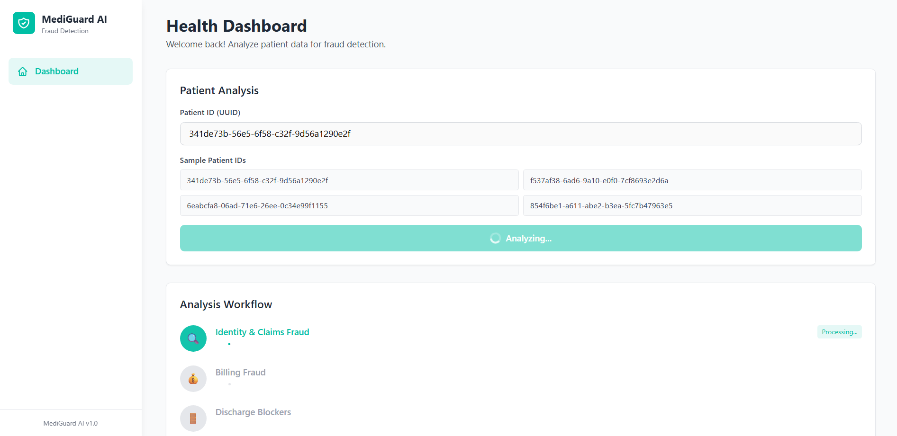
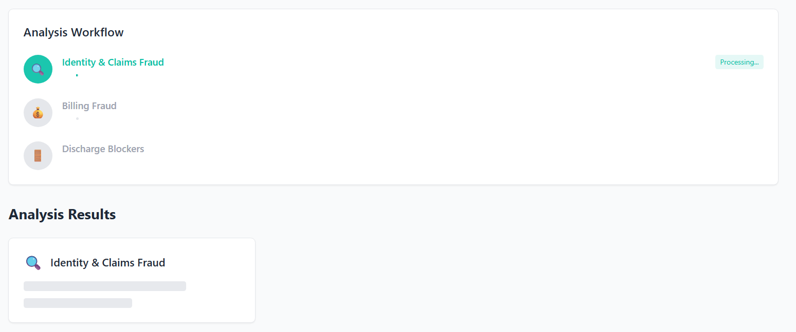
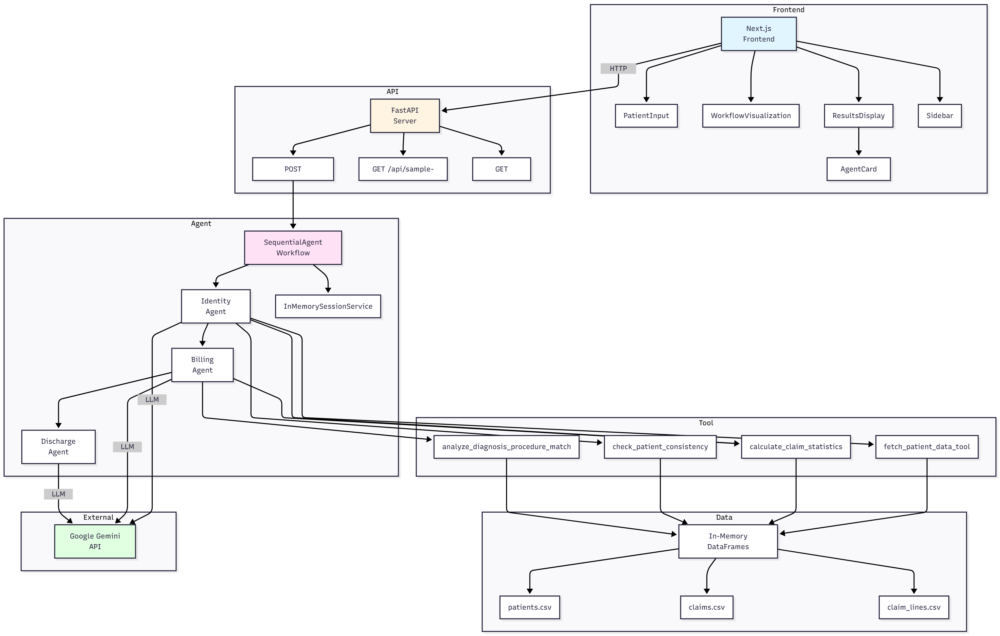
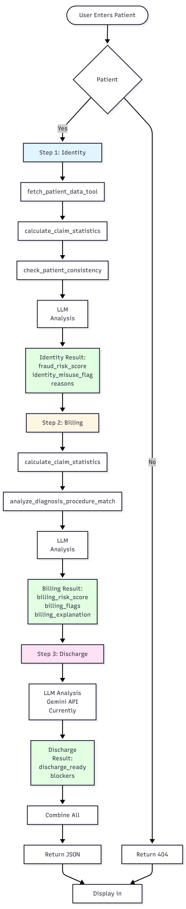

# MediGuard AI - Healthcare Fraud Detection System

A multi-agent AI system for healthcare fraud detection and discharge management using Google ADK (Agent Development Kit) and Google Gemini 2.5. This system analyzes patient data to detect identity misuse, billing fraud, and discharge blockers through a sequential workflow of specialized AI agents.



## 🎬 Demo Video

Watch the system in action! See how the three-agent workflow analyzes patient data and detects fraud patterns:

[](https://youtu.be/szNQj8By6nU?si=HB0-oKmbSg5Ooonc)

**[📺 Watch on YouTube](https://youtu.be/szNQj8By6nU?si=HB0-oKmbSg5Ooonc)**

## 🎯 Features

### Three Specialized AI Agents

1. **Agent 1: Identity & Claims Fraud Detection** 
   - Detects fake claims and identity misuse patterns
   - Analyzes patient data consistency across multiple claims
   - Identifies suspicious diagnosis-procedure combinations
   - Flags unusually high claim amounts
   - Uses custom tools: `fetch_patient_data_tool`, `calculate_claim_statistics`, `check_patient_consistency`

2. **Agent 2: Billing Fraud Analysis**
   - Identifies inflated or unnecessary billing items
   - Analyzes billing anomalies, upcoding, and unbundling patterns
   - Verifies procedure-diagnosis matches
   - Checks for duplicate/add-on procedures and charges above normal ranges
   - Uses custom tools: `calculate_claim_statistics`, `analyze_diagnosis_procedure_match`

3. **Agent 3: Discharge Blockers Assessment**
   - Determines what's preventing patient discharge
   - Identifies blockers (pending labs, scans, paperwork, fraud investigations)
   - Checks for active inpatient encounters
   - Estimates delay hours if not ready for discharge
   - Uses custom tools: `get_active_encounters`, `get_pending_procedures`, `check_discharge_readiness`

### Modern Web Interface

- **Real-time Workflow Visualization** - See each agent's progress as analysis runs
- **Progressive Results Display** - Results appear as each agent completes
- **Clean Next.js Frontend** - Modern, responsive UI built with Tailwind CSS
- **Sample Patient IDs** - Easy access to test patient data



## 📋 Prerequisites

- **Python 3.10+** (required for Google ADK)
- **Node.js 18+** and npm
- **Google Gemini API Key** - Get one from [Google AI Studio](https://makersuite.google.com/app/apikey)

## 🚀 Quick Start

### 1. Clone the Repository

```bash
git clone <repository-url>
cd mediguard-ai
```

### 2. Backend Setup

```bash
# Install Python dependencies
pip install -r requirements.txt

# Create .env file
cp .env.example .env
# Edit .env and add your Google API key:
# GOOGLE_API_KEY=your_api_key_here
```

### 3. Frontend Setup

```bash
cd frontend

# Install dependencies
npm install

# (Optional) Create .env.local for custom backend URL
# PYTHON_API_URL=http://localhost:8000
```

### 4. Run the Application

**Terminal 1 - Start Backend:**
```bash
python api_server.py
```
Backend will run on `http://localhost:8000`

**Terminal 2 - Start Frontend:**
```bash
cd frontend
npm run dev
```
Frontend will run on `http://localhost:3000`

### 5. Access the Application

Open your browser and navigate to `http://localhost:3000`


## 📁 Project Structure

```
mediguard-ai/
├── main.py                 # Core ADK agents and workflow orchestration
├── tools_adk.py            # ADK FunctionTools for agents
├── api_server.py           # FastAPI backend server
├── requirements.txt        # Python dependencies
├── data1/                  # Synthea data files (patients, claims, claim_lines)
├── frontend/               # Next.js frontend application
│   ├── app/               # Next.js app router pages
│   ├── components/        # React components
│   │   ├── AgentCard.tsx
│   │   ├── PatientInput.tsx
│   │   ├── ResultsDisplay.tsx
│   │   ├── Sidebar.tsx
│   │   ├── WorkflowVisualization.tsx
│   │   └── RiskScoreBadge.tsx
│   └── package.json       # Frontend dependencies
├── img/                    # Application screenshots
│   ├── dashboard-patient-input.png
│   ├── dashboard-analysis-in-progress.png
│   ├── workflow-identity-processing.png
│   ├── workflow-complete-results.png
│   ├── results-all-agents.png
│   └── dashboard-final-results.png
└── docs/                  # Documentation
    ├── BACKEND.md         # Backend function documentation
    ├── FRONTEND.md        # Frontend component documentation
    └── synthea-data-mapping.md
```

## 🔧 Configuration

### Environment Variables

**Backend (.env):**
```
GOOGLE_API_KEY=your_google_gemini_api_key
```

**Frontend (.env.local):**
```
PYTHON_API_URL=http://localhost:8000
```

## 📊 Data Requirements

The system expects Synthea-generated CSV files in the `data1/` folder:

- `patients.csv` - Patient demographics (Id, SSN, DOB, name, address, etc.)
- `claims.csv` - Claim-level data (claim_id, patient_id, diagnosis, costs, dates)
- `claim_lines.csv` - Detailed billing line items (procedure codes, charges)

See `docs/synthea-data-mapping.md` for detailed data structure requirements.

## 🧪 Testing

### Test with Sample Patient ID

1. Start both backend and frontend servers
2. Open the frontend at `http://localhost:3000`
3. Enter a patient UUID (e.g., `341de73b-56e5-6f58-c32f-9d56a1290e2f`)
4. Click "Start Analysis" to run all three agents sequentially


### Get Sample Patient IDs

The frontend will show sample patient IDs when you run it, or you can query:
```bash
curl http://localhost:8000/api/sample-ids
```

## 🏗️ Architecture

### System Architecture



The system follows a **layered architecture** with clear separation of concerns:

- **Frontend Layer** - Next.js application with React components (Port 3000)
- **API Layer** - FastAPI REST API server (Port 8000)
- **Agent Orchestration** - SequentialAgent managing three specialized LlmAgents
- **Tool Layer** - Custom ADK FunctionTools for data access and analysis
- **Data Layer** - In-memory Pandas DataFrames loaded from CSV files
- **External Services** - Google Gemini API for LLM inference

### Agent Workflow



The system uses a **sequential workflow** where agents run one after another:

1. **Identity Agent** → Analyzes patient data for fraud patterns using multiple tools
2. **Billing Agent** → Uses identity results to assess billing fraud
3. **Discharge Agent** → Uses identity and billing results to assess discharge readiness and identify blockers

Each agent makes tool calls to access data, then performs LLM analysis via Gemini API before passing results to the next agent.

**📖 For detailed architecture documentation, see [Architecture Documentation](docs/ARCHITECTURE.md)**

### Technology Stack

**Backend:**
- Google ADK (Agent Development Kit) - For agent orchestration
- Google Gemini 2.5 Flash Lite - LLM for agent reasoning
- FastAPI - REST API server
- Pandas - Data processing
- Python 3.10+

**Frontend:**
- Next.js 14+ - React framework
- TypeScript - Type safety
- Tailwind CSS - Styling
- React Hooks - State management

## 📚 Documentation

- **[Architecture Documentation](docs/ARCHITECTURE.md)** - Comprehensive system architecture, diagrams, and design decisions
- **[Backend Documentation](docs/BACKEND.md)** - Detailed explanation of all backend functions, agents, and tools
- **[Frontend Documentation](docs/FRONTEND.md)** - Component and function documentation
- **[Synthea Data Mapping](docs/synthea-data-mapping.md)** - Data structure requirements

## 🛠️ Development

### Backend Development

```bash
# Run backend in development mode
python api_server.py

# Test individual agent
python main.py <patient_id>
```

### Frontend Development

```bash
cd frontend
npm run dev      # Development server
npm run build    # Production build
npm run start    # Production server
```

## 🔍 API Endpoints

### Backend API (Port 8000)

- `GET /` - API information
- `GET /api/sample-ids?limit=10` - Get sample patient IDs
- `POST /api/analyze` - Run full analysis (all agents)
  ```json
  {
    "patient_id": "uuid-here"
  }
  ```
- `POST /api/analyze/agent1` - Run only Agent 1 (Identity)
- `GET /health` - Health check

### Frontend API Routes (Port 3000)

- `POST /api/analyze` - Proxy to backend analysis
- `GET /api/sample-ids` - Proxy to backend sample IDs

## 📸 Screenshots & Demo

### Demo Video

[](https://youtu.be/szNQj8By6nU?si=HB0-oKmbSg5Ooonc)

**[🎥 Watch Full Demo Video](https://youtu.be/szNQj8By6nU?si=HB0-oKmbSg5Ooonc)** - See the complete workflow in action!

### Dashboard Views

- **[Patient Input](img/dashboard-patient-input.png)** - Initial dashboard with patient ID input and sample IDs
- **[Analysis in Progress](img/dashboard-analysis-in-progress.png)** - Dashboard showing active analysis workflow
- **[Final Results](img/dashboard-final-results.png)** - Complete analysis results displayed

### Workflow Views

- **[Identity Processing](img/workflow-identity-processing.png)** - Workflow showing Identity agent in progress
- **[Complete Results](img/workflow-complete-results.png)** - All agents completed with results

### Results Views

- **[All Agents Results](img/results-all-agents.png)** - Detailed results from all three agents

## 🐛 Troubleshooting

**Backend not starting:**
- Check that Python 3.10+ is installed (ADK requirement)
- Verify all dependencies are installed: `pip install -r requirements.txt`
- Ensure `.env` file exists with `GOOGLE_API_KEY`
- Check that data files exist in `data1/` folder

**Frontend not connecting to backend:**
- Verify backend is running on port 8000
- Check `PYTHON_API_URL` in frontend `.env.local`
- Check browser console for CORS errors
- Ensure both servers are running simultaneously

**Patient ID not found:**
- Verify patient ID exists in `data1/patients.csv`
- Check that CSV files are in the correct location (`data1/` folder)
- Ensure patient IDs are UUIDs, not simple IDs
- Verify CSV files are properly formatted

**Analysis errors:**
- Check backend logs for detailed error messages
- Verify Google API key is valid and has quota remaining
- Ensure data files are properly formatted
- Check for session conflicts (restart backend if needed)

**Slow performance:**
- Identity agent may take 60-120 seconds due to multiple tool calls
- Billing agent typically takes 10-20 seconds
- Consider optimizing by pre-fetching patient data
- Check API quota limits

## 🔄 Current Status

- ✅ **Agent 1 (Identity)**: Fully implemented and working
- ✅ **Agent 2 (Billing)**: Fully implemented and working
- ✅ **Agent 3 (Discharge)**: Fully implemented and working
- ✅ **Frontend**: Fully functional with real-time workflow visualization
- ✅ **Backend API**: Complete with error handling and logging

## 📝 License

This project is part of an AI Agents capstone project.

## 🤝 Contributing

This is a capstone project. For questions or issues, please refer to the documentation or contact the project maintainers.

## 🙏 Acknowledgments

- Built with [Google ADK](https://google.github.io/adk-docs/) (Agent Development Kit)
- Uses [Google Gemini 2.5](https://ai.google.dev/) for AI analysis
- Features: Sequential agents, custom tools, built-in observability, session management
- Frontend built with [Next.js](https://nextjs.org/) and [Tailwind CSS](https://tailwindcss.com/)
- Data generated using [Synthea](https://github.com/synthetichealth/synthea)

---

**Version:** 2.0.0  
**Last Updated:** November 2025  
**Framework:** Google ADK with Gemini 2.5 Flash Lite
