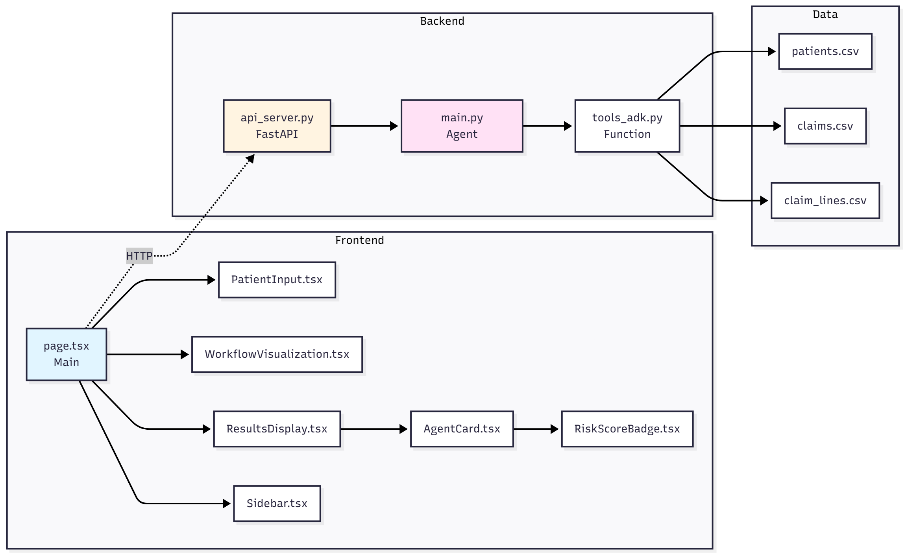
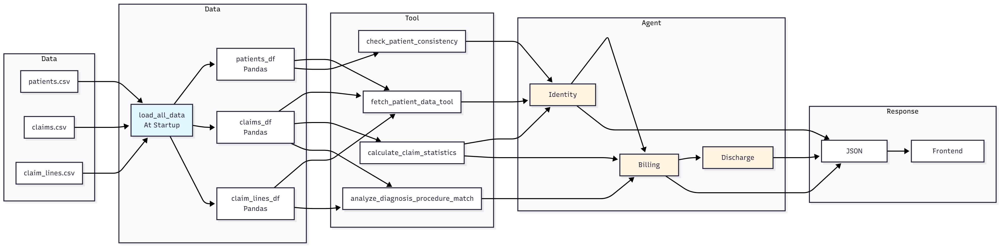

# MediGuard AI - System Architecture Documentation

Comprehensive architecture documentation for the MediGuard AI healthcare fraud detection system. This document provides detailed explanations of system components, data flow, agent workflows, and technology stack.

## Table of Contents

1. [System Overview](#system-overview)
2. [High-Level Architecture](#high-level-architecture)
3. [Agent Workflow](#agent-workflow)
4. [Component Architecture](#component-architecture)
5. [Data Flow](#data-flow)
6. [Sequence Diagram](#sequence-diagram)
7. [Technology Stack](#technology-stack)
8. [Architecture Patterns](#architecture-patterns)

---

## System Overview

MediGuard AI is a multi-agent healthcare fraud detection system built using Google ADK (Agent Development Kit). The system analyzes patient data from Synthea-generated healthcare records to detect:

- **Identity Fraud** - Duplicate or inconsistent patient information across claims
- **Billing Fraud** - Inflated charges, upcoding, unbundling patterns
- **Discharge Blockers** - Issues preventing patient discharge (awaiting implementation)

### Key Characteristics

- **Architecture Pattern**: Multi-Agent System with Sequential Workflow
- **Backend Framework**: FastAPI (Python)
- **Frontend Framework**: Next.js (React/TypeScript)
- **AI Framework**: Google ADK with Gemini 2.5 Flash Lite
- **Data Source**: Synthea CSV files (patients, claims, claim_lines)

---

## High-Level Architecture


The system follows a **layered architecture** with clear separation of concerns:

### Layer Breakdown

1. **Frontend Layer (Port 3000)**
   - Next.js application with React components
   - Real-time workflow visualization
   - Progressive results display
   - Components: PatientInput, WorkflowVisualization, ResultsDisplay, AgentCard

2. **API Layer (Port 8000)**
   - FastAPI REST API server
   - Endpoints: `/api/analyze`, `/api/sample-ids`
   - Request validation and response formatting
   - CORS middleware for frontend communication

3. **Agent Orchestration Layer**
   - SequentialAgent workflow orchestrator
   - Three specialized LlmAgents:
     - Identity Agent (fraud detection)
     - Billing Agent (billing analysis)
     - Discharge Agent (discharge assessment - disabled)
   - InMemorySessionService for session management

4. **Tool Layer**
   - Custom ADK FunctionTools:
     - `fetch_patient_data_tool` - Retrieves patient data
     - `calculate_claim_statistics` - Computes statistical metrics
     - `check_patient_consistency` - Verifies data consistency
     - `analyze_diagnosis_procedure_match` - Validates procedure-diagnosis matches

5. **Data Layer**
   - In-memory Pandas DataFrames loaded at startup
   - CSV files: `patients.csv`, `claims.csv`, `claim_lines.csv`
   - Efficient querying and filtering

6. **External Services**
   - Google Gemini API (2.5 Flash Lite) for LLM inference

### Component Connections

- **Frontend → API**: HTTP REST requests
- **API → Workflow**: Direct function calls
- **Workflow → Agents**: Sequential execution
- **Agents → Tools**: FunctionTool calls
- **Tools → Data**: DataFrame queries
- **Agents → Gemini**: LLM API calls

---

## Agent Workflow


The system uses a **sequential workflow** where agents execute one after another, with each agent receiving the previous agent's output.

### Workflow Steps

1. **Step 1: Identity Agent**
   - Uses `fetch_patient_data_tool` to retrieve patient data
   - Calls `calculate_claim_statistics` for statistical insights
   - Uses `check_patient_consistency` to verify data consistency
   - Makes LLM call to Gemini API for fraud analysis
   - Returns: `fraud_risk_score`, `identity_misuse_flag`, `reasons`

2. **Step 2: Billing Agent**
   - Receives Identity Agent results as input
   - Uses `calculate_claim_statistics` for claim cost analysis
   - Calls `analyze_diagnosis_procedure_match` for validation
   - Makes LLM call to Gemini API for billing fraud analysis
   - Returns: `billing_risk_score`, `billing_flags`, `billing_explanation`

3. **Step 3: Discharge Agent** *(Currently Disabled)*
   - Receives both Identity and Billing results
   - Makes LLM call to Gemini API for discharge assessment
   - Returns: `discharge_ready`, `blockers`, `delay_hours`

### Workflow Characteristics

- **Sequential Execution**: Agents run one after another (not parallel)
- **State Passing**: Each agent receives previous agent's output
- **Tool Usage**: Agents can call multiple tools before LLM analysis
- **Error Handling**: Validation at each step with fallback mechanisms

---

## Component Architecture



### Frontend Components

| Component | Purpose | Key Features |
|-----------|---------|--------------|
| `page.tsx` | Main application page | State management, API calls, workflow orchestration |
| `PatientInput.tsx` | Patient ID input form | Sample ID access, validation |
| `WorkflowVisualization.tsx` | Visual workflow progress | Real-time step indicators, progress tracking |
| `ResultsDisplay.tsx` | Results container | Progressive loading, result aggregation |
| `AgentCard.tsx` | Individual agent result | Risk score display, flags, explanations |
| `Sidebar.tsx` | Navigation sidebar | Static navigation component |
| `RiskScoreBadge.tsx` | Risk score visualization | Color-coded risk indicators |

### Backend Components

| Component | Purpose | Key Functions |
|-----------|---------|--------------|
| `api_server.py` | FastAPI REST API | `analyze_patient_endpoint()`, `get_sample_ids()` |
| `main.py` | Agent definitions & workflow | `analyze_patient()`, `analyze_patient_async()` |
| `tools_adk.py` | ADK FunctionTools | Tool implementations for data access and analysis |

### Component Relationships

- Frontend components communicate via React state
- Frontend makes HTTP requests to FastAPI backend
- Backend calls agent workflow functions
- Agents use tools to access data layer
- Tools query in-memory DataFrames

---

## Data Flow



### Data Flow Stages

1. **Data Loading (Startup)**
   - CSV files loaded into Pandas DataFrames
   - Data stored in memory for fast access
   - Tools initialized with data references

2. **Patient Data Retrieval**
   - Agent calls `fetch_patient_data_tool` with patient_id
   - Tool filters DataFrames by patient_id
   - Returns structured dictionary: `{patient, claims, claim_lines}`

3. **Statistical Analysis**
   - Tools calculate statistics from filtered data
   - Results passed to agents for analysis
   - Examples: average costs, max costs, consistency checks

4. **Agent Processing**
   - Each agent receives data/tools
   - Makes LLM API calls to Gemini
   - Returns structured JSON responses

5. **Response Aggregation**
   - All agent results combined
   - Structured response sent to frontend
   - Frontend displays progressive results

### Data Flow Path

```
CSV Files → DataFrames (Startup)
    ↓
Patient ID Request
    ↓
Tools Filter DataFrames
    ↓
Agents Process Data
    ↓
LLM Analysis (Gemini API)
    ↓
JSON Results
    ↓
API Response
    ↓
Frontend Display
```

---

## Sequence Diagram


The sequence diagram shows the complete interaction flow from user input to results display:

1. **User Input**: User enters patient ID in frontend
2. **API Request**: Frontend sends POST request to `/api/analyze`
3. **Patient Validation**: API validates patient exists in data
4. **Workflow Execution**: SequentialAgent orchestrates agent execution
5. **Agent 1 (Identity)**:
   - Calls tools to fetch and analyze data
   - Makes LLM call to Gemini
   - Returns identity analysis result
6. **Agent 2 (Billing)**:
   - Receives identity result
   - Calls tools for billing analysis
   - Makes LLM call to Gemini
   - Returns billing analysis result
7. **Agent 3 (Discharge)**:
   - Receives both previous results
   - Makes LLM call to Gemini
   - Returns discharge assessment
8. **Response**: Combined results sent back to frontend
9. **Display**: Frontend displays results progressively

### Key Interactions

- **Synchronous Tool Calls**: Tools execute synchronously before LLM calls
- **Asynchronous LLM Calls**: Each agent makes async calls to Gemini API
- **Progressive Updates**: Frontend updates as each agent completes
- **Error Handling**: Errors caught and returned with appropriate status codes

---

## Technology Stack

### Frontend Stack

| Technology | Version | Purpose |
|------------|---------|---------|
| Next.js | 14+ | React framework with SSR capabilities |
| TypeScript | Latest | Type safety and better developer experience |
| React | 18+ | UI library for component-based development |
| Tailwind CSS | Latest | Utility-first CSS framework for styling |

### Backend Stack

| Technology | Version | Purpose |
|------------|---------|---------|
| Python | 3.10+ | Core programming language (required for ADK) |
| FastAPI | Latest | Modern REST API framework |
| Pandas | Latest | Data manipulation and analysis |
| python-dotenv | Latest | Environment variable management |

### AI Stack

| Technology | Version | Purpose |
|------------|---------|---------|
| Google ADK | Latest | Agent Development Kit for orchestration |
| Google Gemini | 2.5 Flash Lite | Large Language Model for agent reasoning |
| LlmAgent | ADK | Agent type for LLM-based agents |
| SequentialAgent | ADK | Workflow orchestrator for sequential execution |

### Data Storage

| Technology | Purpose |
|------------|---------|
| CSV Files | Source data files (patients, claims, claim_lines) |
| Pandas DataFrames | In-memory data storage for fast querying |

---

## Architecture Patterns

### 1. Sequential Agent Pattern

- **Pattern**: Agents execute in strict sequence
- **Implementation**: SequentialAgent orchestrator
- **Benefits**: Clear data flow, predictable execution order
- **Use Case**: When agents depend on previous agent's output

### 2. Tool-Based Agent Pattern

- **Pattern**: Agents use FunctionTools for data access
- **Implementation**: Custom ADK FunctionTools
- **Benefits**: Separation of concerns, reusable tools, testable components
- **Use Case**: When agents need to access external data or perform calculations

### 3. Session Management Pattern

- **Pattern**: Each agent uses separate session
- **Implementation**: InMemorySessionService
- **Benefits**: Session isolation, prevents conflicts, state management
- **Use Case**: When multiple agents need independent state

### 4. Progressive UI Pattern

- **Pattern**: Frontend displays results as agents complete
- **Implementation**: React state updates with progressive loading
- **Benefits**: Better UX, real-time feedback, perceived performance
- **Use Case**: When operations take time and users need feedback

### 5. Layered Architecture Pattern

- **Pattern**: Clear separation of layers (Frontend, API, Agents, Tools, Data)
- **Implementation**: Modular component structure
- **Benefits**: Maintainability, scalability, testability
- **Use Case**: Complex systems with multiple concerns

---

## Design Decisions

### Why Sequential Agents?

- **Dependency Chain**: Billing agent needs identity results, discharge needs both
- **Data Flow**: Clear data flow from one agent to the next
- **Simplicity**: Easier to debug and understand execution order

### Why In-Memory DataFrames?

- **Performance**: Fast querying without database overhead
- **Simplicity**: No database setup required
- **Scalability**: Sufficient for current data size (can migrate to DB later)

### Why Google ADK?

- **Modern Framework**: Built specifically for agent development
- **Built-in Features**: Session management, observability, tool integration
- **Gemini Integration**: Native support for Google Gemini models

### Why FastAPI?

- **Performance**: High performance async framework
- **Type Safety**: Pydantic models for request/response validation
- **Documentation**: Auto-generated API documentation
- **Modern**: Python 3.10+ features support

---

## Future Enhancements

### Performance Optimizations

- **Parallel Agent Execution**: Run independent agents in parallel
- **Data Caching**: Cache patient data and analysis results
- **Pre-fetching**: Pre-fetch patient data before agent execution

### Scalability Improvements

- **Database Migration**: Move from CSV to PostgreSQL/MongoDB
- **Message Queue**: Use Redis/RabbitMQ for async processing
- **Microservices**: Split agents into separate services

### Feature Additions

- **Real-time Updates**: WebSocket for real-time progress updates
- **Batch Processing**: Process multiple patients simultaneously
- **Agent Optimization**: Reduce LLM calls through better tool design
- **Caching Layer**: Add Redis for result caching

---

## Related Documentation

- **[Backend Documentation](BACKEND.md)** - Detailed backend function documentation
- **[Frontend Documentation](FRONTEND.md)** - Frontend component documentation
- **[Synthea Data Mapping](synthea-data-mapping.md)** - Data structure requirements
- **[README](../README.md)** - Project overview and quick start guide

---

**Document Version:** 1.0  
**Last Updated:** November 2025  
**Maintained By:** MediGuard AI Team

