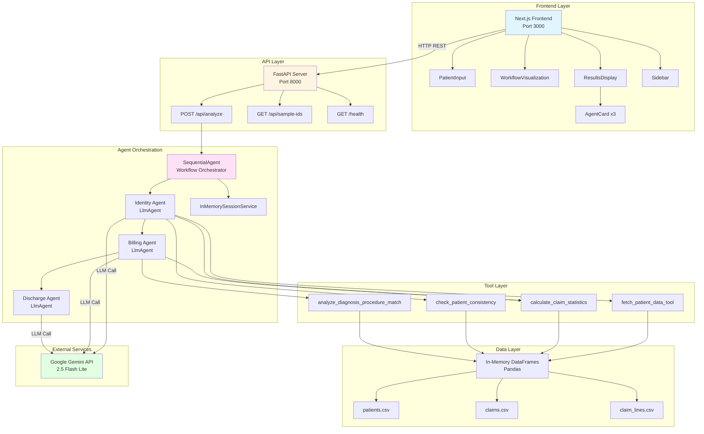

# System Architecture Diagram

High-level overview of the MediGuard AI system architecture showing all layers and components.

```mermaid
graph TB
    subgraph "Frontend Layer"
        UI[Next.js Frontend<br/>Port 3000]
        COMP1[PatientInput]
        COMP2[WorkflowVisualization]
        COMP3[ResultsDisplay]
        COMP4[AgentCard x3]
        COMP5[Sidebar]
    end
    
    subgraph "API Layer"
        API[FastAPI Server<br/>Port 8000]
        EP1[POST /api/analyze]
        EP2[GET /api/sample-ids]
        EP3[GET /health]
    end
    
    subgraph "Agent Orchestration"
        WORKFLOW[SequentialAgent<br/>Workflow Orchestrator]
        AGENT1[Identity Agent<br/>LlmAgent]
        AGENT2[Billing Agent<br/>LlmAgent]
        AGENT3[Discharge Agent<br/>LlmAgent]
        SESSION[InMemorySessionService]
    end
    
    subgraph "Tool Layer"
        TOOL1[fetch_patient_data_tool]
        TOOL2[calculate_claim_statistics]
        TOOL3[check_patient_consistency]
        TOOL4[analyze_diagnosis_procedure_match]
    end
    
    subgraph "Data Layer"
        MEM[In-Memory DataFrames<br/>Pandas]
        CSV1[patients.csv]
        CSV2[claims.csv]
        CSV3[claim_lines.csv]
    end
    
    subgraph "External Services"
        GEMINI[Google Gemini API<br/>2.5 Flash Lite]
    end
    
    UI --> COMP1
    UI --> COMP2
    UI --> COMP3
    UI --> COMP5
    COMP3 --> COMP4
    
    UI -->|HTTP REST| API
    API --> EP1
    API --> EP2
    API --> EP3
    
    EP1 --> WORKFLOW
    WORKFLOW --> SESSION
    WORKFLOW --> AGENT1
    AGENT1 --> AGENT2
    AGENT2 --> AGENT3
    
    AGENT1 --> TOOL1
    AGENT1 --> TOOL2
    AGENT1 --> TOOL3
    AGENT2 --> TOOL2
    AGENT2 --> TOOL4
    
    TOOL1 --> MEM
    TOOL2 --> MEM
    TOOL3 --> MEM
    TOOL4 --> MEM
    
    MEM --> CSV1
    MEM --> CSV2
    MEM --> CSV3
    
    AGENT1 -->|LLM Call| GEMINI
    AGENT2 -->|LLM Call| GEMINI
    AGENT3 -->|LLM Call| GEMINI
    
    style UI fill:#e1f5ff
    style API fill:#fff4e1
    style WORKFLOW fill:#ffe1f5
    style GEMINI fill:#e1ffe1
```

