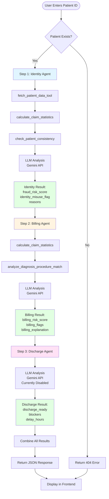

# Agent Workflow Sequence Diagram

Sequential workflow showing how agents execute one after another with tool calls and LLM interactions.

```mermaid
flowchart TD
    START([User Enters Patient ID]) --> VALIDATE{Patient Exists?}
    VALIDATE -->|No| ERROR[Return 404 Error]
    VALIDATE -->|Yes| STEP1[Step 1: Identity Agent]
    
    STEP1 --> ID_TOOL1[fetch_patient_data_tool]
    ID_TOOL1 --> ID_TOOL2[calculate_claim_statistics]
    ID_TOOL2 --> ID_TOOL3[check_patient_consistency]
    ID_TOOL3 --> ID_LLM[LLM Analysis<br/>Gemini API]
    ID_LLM --> ID_RESULT[Identity Result:<br/>fraud_risk_score<br/>identity_misuse_flag<br/>reasons]
    
    ID_RESULT --> STEP2[Step 2: Billing Agent]
    STEP2 --> BILL_TOOL1[calculate_claim_statistics]
    BILL_TOOL1 --> BILL_TOOL2[analyze_diagnosis_procedure_match]
    BILL_TOOL2 --> BILL_LLM[LLM Analysis<br/>Gemini API]
    BILL_LLM --> BILL_RESULT[Billing Result:<br/>billing_risk_score<br/>billing_flags<br/>billing_explanation]
    
    BILL_RESULT --> STEP3[Step 3: Discharge Agent]
    STEP3 --> DIS_LLM[LLM Analysis<br/>Gemini API<br/>Currently Disabled]
    DIS_LLM --> DIS_RESULT[Discharge Result:<br/>discharge_ready<br/>blockers<br/>delay_hours]
    
    DIS_RESULT --> COMBINE[Combine All Results]
    COMBINE --> RESPONSE[Return JSON Response]
    RESPONSE --> FRONTEND[Display in Frontend]
    
    ERROR --> FRONTEND
    
    style STEP1 fill:#e1f5ff
    style STEP2 fill:#fff4e1
    style STEP3 fill:#ffe1f5
    style ID_RESULT fill:#e1ffe1
    style BILL_RESULT fill:#e1ffe1
    style DIS_RESULT fill:#e1ffe1
```

