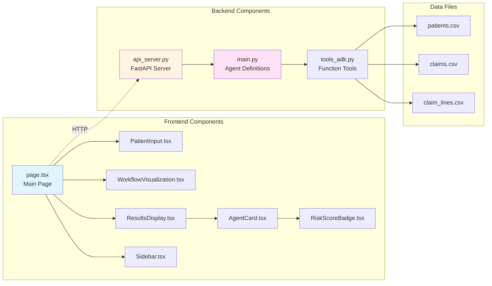

# Component Architecture Diagram

Detailed view of frontend and backend components and their relationships.

```mermaid
graph LR
    subgraph "Frontend Components"
        PAGE[page.tsx<br/>Main Page]
        INPUT[PatientInput.tsx]
        WORKFLOW[WorkflowVisualization.tsx]
        RESULTS[ResultsDisplay.tsx]
        CARD[AgentCard.tsx]
        SIDEBAR[Sidebar.tsx]
        BADGE[RiskScoreBadge.tsx]
    end
    
    subgraph "Backend Components"
        API_SERVER[api_server.py<br/>FastAPI Server]
        MAIN[main.py<br/>Agent Definitions]
        TOOLS[tools_adk.py<br/>Function Tools]
    end
    
    subgraph "Data Files"
        CSV1[patients.csv]
        CSV2[claims.csv]
        CSV3[claim_lines.csv]
    end
    
    PAGE --> INPUT
    PAGE --> WORKFLOW
    PAGE --> RESULTS
    PAGE --> SIDEBAR
    RESULTS --> CARD
    CARD --> BADGE
    
    PAGE -.HTTP.-> API_SERVER
    API_SERVER --> MAIN
    MAIN --> TOOLS
    TOOLS --> CSV1
    TOOLS --> CSV2
    TOOLS --> CSV3
    
    style PAGE fill:#e1f5ff
    style API_SERVER fill:#fff4e1
    style MAIN fill:#ffe1f5
```

