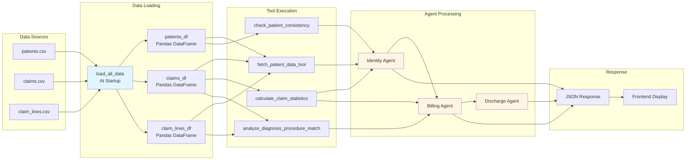

# Data Flow Diagram

Shows how data flows from CSV files through DataFrames, tools, agents, and back to the frontend.

```mermaid
flowchart LR
    subgraph "Data Sources"
        CSV1[patients.csv]
        CSV2[claims.csv]
        CSV3[claim_lines.csv]
    end
    
    subgraph "Data Loading"
        LOAD[load_all_data<br/>At Startup]
        DF1[patients_df<br/>Pandas DataFrame]
        DF2[claims_df<br/>Pandas DataFrame]
        DF3[claim_lines_df<br/>Pandas DataFrame]
    end
    
    subgraph "Tool Execution"
        FETCH[fetch_patient_data_tool]
        STATS[calculate_claim_statistics]
        CONSIST[check_patient_consistency]
        MATCH[analyze_diagnosis_procedure_match]
    end
    
    subgraph "Agent Processing"
        AGENT1[Identity Agent]
        AGENT2[Billing Agent]
        AGENT3[Discharge Agent]
    end
    
    subgraph "Response"
        JSON[JSON Response]
        FRONTEND[Frontend Display]
    end
    
    CSV1 --> LOAD
    CSV2 --> LOAD
    CSV3 --> LOAD
    
    LOAD --> DF1
    LOAD --> DF2
    LOAD --> DF3
    
    DF1 --> FETCH
    DF2 --> FETCH
    DF3 --> FETCH
    DF2 --> STATS
    DF1 --> CONSIST
    DF2 --> MATCH
    DF3 --> MATCH
    
    FETCH --> AGENT1
    STATS --> AGENT1
    CONSIST --> AGENT1
    AGENT1 --> AGENT2
    STATS --> AGENT2
    MATCH --> AGENT2
    AGENT2 --> AGENT3
    
    AGENT1 --> JSON
    AGENT2 --> JSON
    AGENT3 --> JSON
    JSON --> FRONTEND
    
    style LOAD fill:#e1f5ff
    style AGENT1 fill:#fff4e1
    style AGENT2 fill:#fff4e1
    style AGENT3 fill:#fff4e1
```

