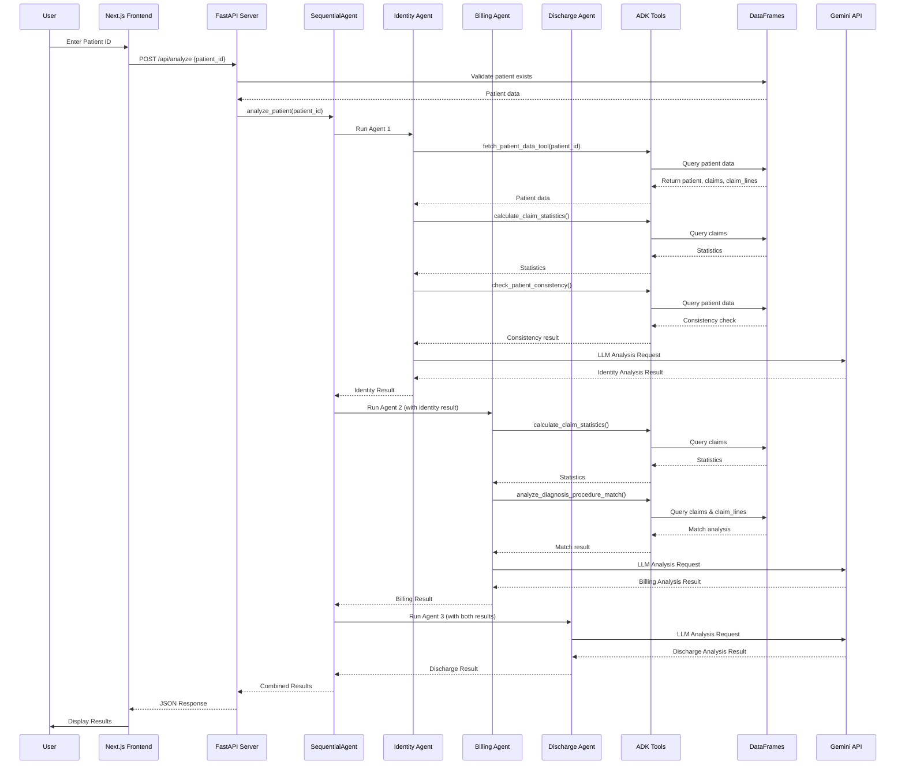

# Complete Sequence Diagram

Detailed sequence diagram showing the complete interaction flow from user input to results display.

```mermaid
sequenceDiagram
    participant User
    participant Frontend as Next.js Frontend
    participant API as FastAPI Server
    participant Workflow as SequentialAgent
    participant Identity as Identity Agent
    participant Billing as Billing Agent
    participant Discharge as Discharge Agent
    participant Tools as ADK Tools
    participant Data as DataFrames
    participant Gemini as Gemini API

    User->>Frontend: Enter Patient ID
    Frontend->>API: POST /api/analyze {patient_id}
    API->>Data: Validate patient exists
    Data-->>API: Patient data
    
    API->>Workflow: analyze_patient(patient_id)
    
    Workflow->>Identity: Run Agent 1
    Identity->>Tools: fetch_patient_data_tool(patient_id)
    Tools->>Data: Query patient data
    Data-->>Tools: Return patient, claims, claim_lines
    Tools-->>Identity: Patient data
    
    Identity->>Tools: calculate_claim_statistics()
    Tools->>Data: Query claims
    Data-->>Tools: Statistics
    Tools-->>Identity: Statistics
    
    Identity->>Tools: check_patient_consistency()
    Tools->>Data: Query patient data
    Data-->>Tools: Consistency check
    Tools-->>Identity: Consistency result
    
    Identity->>Gemini: LLM Analysis Request
    Gemini-->>Identity: Identity Analysis Result
    Identity-->>Workflow: Identity Result
    
    Workflow->>Billing: Run Agent 2 (with identity result)
    Billing->>Tools: calculate_claim_statistics()
    Tools->>Data: Query claims
    Data-->>Tools: Statistics
    Tools-->>Billing: Statistics
    
    Billing->>Tools: analyze_diagnosis_procedure_match()
    Tools->>Data: Query claims & claim_lines
    Data-->>Tools: Match analysis
    Tools-->>Billing: Match result
    
    Billing->>Gemini: LLM Analysis Request
    Gemini-->>Billing: Billing Analysis Result
    Billing-->>Workflow: Billing Result
    
    Workflow->>Discharge: Run Agent 3 (with both results)
    Discharge->>Gemini: LLM Analysis Request
    Gemini-->>Discharge: Discharge Analysis Result
    Discharge-->>Workflow: Discharge Result
    
    Workflow-->>API: Combined Results
    API-->>Frontend: JSON Response
    Frontend->>User: Display Results
```

