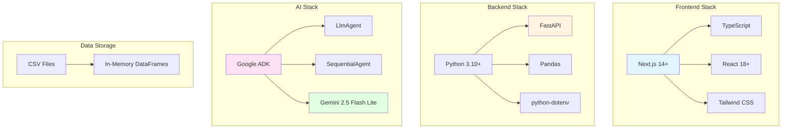

# Technology Stack Diagram

Visual representation of the technology stack used in the project.

```mermaid
graph TB
    subgraph "Frontend Stack"
        NEXT[Next.js 14+]
        TS[TypeScript]
        REACT[React 18+]
        TAILWIND[Tailwind CSS]
    end
    
    subgraph "Backend Stack"
        PYTHON[Python 3.10+]
        FASTAPI[FastAPI]
        PANDAS[Pandas]
        DOTENV[python-dotenv]
    end
    
    subgraph "AI Stack"
        ADK[Google ADK]
        GEMINI[Gemini 2.5 Flash Lite]
        LLMAGENT[LlmAgent]
        SEQUENTIAL[SequentialAgent]
    end
    
    subgraph "Data Storage"
        CSV[CSV Files]
        MEMORY[In-Memory DataFrames]
    end
    
    NEXT --> TS
    NEXT --> REACT
    NEXT --> TAILWIND
    
    PYTHON --> FASTAPI
    PYTHON --> PANDAS
    PYTHON --> DOTENV
    
    ADK --> LLMAGENT
    ADK --> SEQUENTIAL
    ADK --> GEMINI
    
    CSV --> MEMORY
    
    style NEXT fill:#e1f5ff
    style FASTAPI fill:#fff4e1
    style ADK fill:#ffe1f5
    style GEMINI fill:#e1ffe1
```

